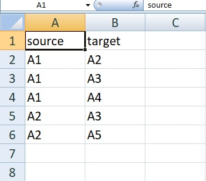

As a part of my ZS internship, I'm supposed to visualise and render high-dimensional data on the browser, which poses several challenges. If built using the 
right tools, data visualisations are one of best ways to tell your data science story. But most often, bulky web plugins, large computation requirements, 
bandwidth limitations turn the best stories into a laggy abstraction.
Over the course of the next several posts, I'll be trying out various visualisation frameworks to get a sense of what works best in a production context.
<div class="divider"></div>
I'll start with one of the popular ones, `D3.js`. According to the [website](https://d3js.org/) : 

> D3.js is a JavaScript library for manipulating documents based on data. D3 helps you bring data to life using HTML, SVG, and CSS. D3’s emphasis on web standards gives you the full capabilities of modern browsers without tying yourself to a proprietary framework, combining powerful visualization components and a data-driven approach to DOM manipulation.

I'll jump directly to an example, and we can figure out stuff on the way. You can refer to the documentation in case you have any doubts. 
I've always been fascinated by graphs, and what better way to test a visulisation library than to try rendering a high dimensional graph on the fly? To start,
we need a data set first. Thankfully, there's no shortage of graph based datasets on the web. But before we move on to the big league, let's check our syntax with a smaller graph.
##### Graph.csv


##### CSS
The CSS to define a node and a link:
```css
<style>

.link {
  stroke: #000;
}

.node {
  stroke: #fff;
}

</style>
```
###### JS


